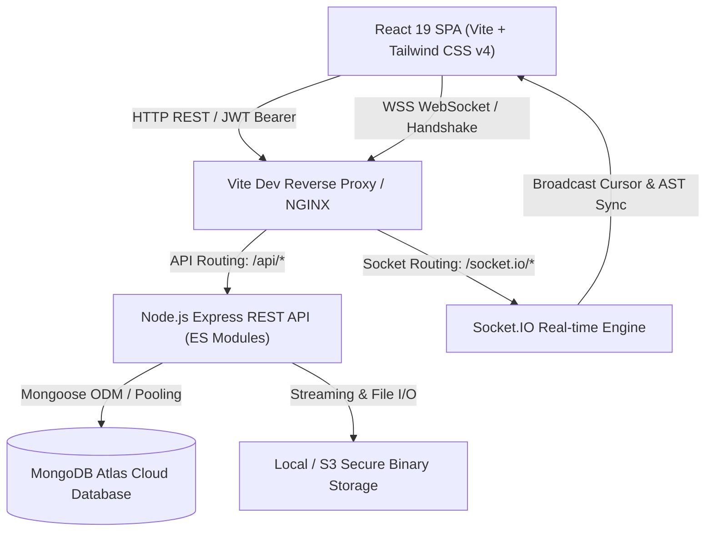

# Smart Document Collaboration Platform (DocSync Pro)

[]()
[](https://nodejs.org/)
[](https://react.dev/)
[](https://tailwindcss.com/)
[](https://www.mongodb.com/)
[]()

> **DocSync Pro** is an enterprise-grade, cloud-native collaborative document workspace designed for modern engineering, product, and business teams. It combines rich WYSIWYG block editing, sub-second real-time multi-user cursor presence, optimistic concurrency control (OCC), fine-grained role-based access control (RBAC), in-line anchor commenting, deep AST content search, and point-in-time version restoration into a unified workspace.

---

## Table of Contents

- [1. Executive System Architecture](#1-executive-system-architecture)
- [2. Core Feature Matrix](#2-core-feature-matrix)
- [3. Technology Stack](#3-technology-stack)
- [4. Repository & Monorepo Structure](#4-repository--monorepo-structure)
- [5. Module Ownership Map](#5-module-ownership-map)
- [6. Prerequisites & Environment Setup](#6-prerequisites--environment-setup)
- [7. Getting Started (Development & Production)](#7-getting-started-development--production)
- [8. Automated Test Suite & Quality Assurance](#8-automated-test-suite--quality-assurance)
- [9. Complete REST API Specification](#9-complete-rest-api-specification)
- [10. Real-time WebSocket Protocol](#10-real-time-websocket-protocol)
- [11. Optimistic Concurrency Control (OCC) Engine](#11-optimistic-concurrency-control-occ-engine)
- [12. Enterprise Security & Hardening Controls](#12-enterprise-security--hardening-controls)
- [13. Troubleshooting & Frequently Asked Questions](#13-troubleshooting--frequently-asked-questions)
- [14. Git Branch & Contribution Workflow](#14-git-branch--contribution-workflow)

---

## 1. Executive System Architecture



---

## 2. Core Feature Matrix

### 1. Document Editor (`DocSync Canvas`)
- **ProseMirror & TipTap WYSIWYG**: Block-level architecture with headings (H1-H3), bullet/ordered lists, task checklists, blockquotes, code blocks with syntax highlighting, tables with contextual cell menus, horizontal rules, and custom font family selection.
- **Immediate Interactive First Paint**: Zero-latency document initialization; new documents load immediately with an active blinking cursor without skeleton flash or layout shifts.
- **Debounced Autosave with Offline Resilience**: Automatically buffers changes at 250ms/1500ms intervals, with full `localStorage` offline queues and automatic sync upon network reconnect.
- **Slash Commands (`/`) & Floating Bubble Menu**: Contextual quick-insert popovers for blocks, tables, callouts, and comment threads.

### 2. Real-Time Collaboration & Presence
- **Multi-Caret Live Presence**: Visual carets, remote selection ranges, and distinct color-coded user avatars updating over WebSockets.
- **Room Isolation**: Automatic workspace and document room binding (`document:<documentId>`), eliminating cross-document packet leakage.
- **Loopback & Echo Suppression**: Synchronous last-seen AST comparison prevents feedback echo loops while preserving user typing focus.

### 3. Workspaces & Hierarchy
- **Isolated Team Workspaces**: Custom workspaces with individual avatars, descriptions, and user membership directories.
- **Nested Folder Hierarchies**: Create, rename, nest, and move folders dynamically with cascade breadcrumb navigation.
- **Granular RBAC**: Strict permission enforcement across four distinct tiers:
  - **Owner**: Full workspace management, member invitation, deletion, document export, and trash purge.
  - **Editor**: Create, edit, tag, and restore documents and folders.
  - **Commenter**: View documents and anchor in-line comment threads.
  - **Viewer**: Read-only access with export restrictions.

### 4. Inline Anchor Comments & Threading
- **Fuzzy Text Selection Anchors**: Comments link to exact AST text ranges, remaining pinned even across document edits.
- **Threaded Discussions**: Nested replies, `@mentions`, resolve/unresolve workflows, and real-time comment notification dispatches.

### 5. Point-in-Time Version History & Checkpoints
- **Incremental Snapshots**: Snapshot checkpoints generated automatically on milestone version increments.
- **Side-by-Side Visual Diffing**: Compare historical versions against the current live AST.
- **One-Click Rollback**: Restore any historical version cleanly without losing collaborator access.

### 6. File Dashboard & Storage Management
- **Universal File Manager**: Upload and preview PDFs, Word documents, Excel spreadsheets, PNGs, and JPEGs.
- **MIME Security Validation**: Whitelist enforcement preventing SVG vectors, HTML scripts, and executable binaries.
- **Soft Deletion & 30-Day Trash**: Two-stage deletion lifecycle with instant restore or administrative permanent purge.

---

## 3. Technology Stack

| Layer | Technologies | Description |
|---|---|---|
| **Frontend Framework** | React 19, React Router DOM 6 | Single-Page Application with code splitting |
| **Styling & Design** | Tailwind CSS v4, Lucide React, clsx | Responsive modern design system with dark mode |
| **Rich Text Core** | TipTap v2/v3, ProseMirror Core | Extensible AST document manipulation engine |
| **Backend Runtime** | Node.js (v18+ LTS, ES Modules), Express 4 | High-throughput REST API server |
| **Real-time Protocol** | Socket.IO (v4) | Bidirectional event-driven WebSockets |
| **Persistence** | MongoDB Atlas, Mongoose 8 ODM | Document database with connection auto-retry |
| **Security & Auth** | JSON Web Tokens (JWT), Bcrypt.js | Stateless bearer authentication with salted hashes |
| **File Processing** | Multer, Node.js Crypto Streams | Multipart file ingestion with SHA-256 validation |
| **Build & Tooling** | Vite 7, PostCSS, ESLint | Instant HMR development and minified bundling |

---

## 4. Repository & Monorepo Structure

```text
smart-document-collaboration-platform/
├── backend/
│   ├── src/
│   │   ├── config/              # Database connections, env parsing, and pool options
│   │   ├── middleware/          # JWT auth, documentPermissions (RBAC), error handler
│   │   ├── modules/
│   │   │   ├── auth/            # User model, registration, login, email verification
│   │   │   ├── workspaces/      # Workspaces, folders, members, teams, permissions
│   │   │   ├── documents/       # AST validation, OCC autosave, tags, templates
│   │   │   ├── collaboration/   # Socket.IO rooms, broadcast handlers, presence
│   │   │   ├── comments/        # In-line text anchors, thread replies, mentions
│   │   │   ├── history-search/  # Version snapshots, AST diffing, regex search
│   │   │   └── files-dashboard/ # File storage, quotas, upload controllers, audit logs
│   │   ├── routes/              # Central express router registration
│   │   ├── scripts/             # Database seeds and user normalization utilities
│   │   ├── app.js               # Express application configuration
│   │   └── server.js            # HTTP and Socket.IO cluster server entry point
│   └── package.json
├── frontend/
│   ├── src/
│   │   ├── app/                 # Root routes, smart back navigation, global styles
│   │   ├── components/          # Branded Avatar, Button, Modal, Toast, NotFoundPage
│   │   ├── modules/
│   │   │   ├── auth/            # Login, SignUp, Password Reset, AuthContext
│   │   │   ├── workspaces/      # Workspace list, overview, folder browser, members
│   │   │   ├── editor/          # Canvas, TipTap hooks, autosave, paper sheet, toolbars
│   │   │   ├── collaboration/   # Presence carets, active avatars, socket client
│   │   │   ├── comments/        # Comments panel, composer, thread cards
│   │   │   ├── history-search/  # Version history drawer, global search modal
│   │   │   ├── files-dashboard/ # File manager grid, storage analytics, activity log
│   │   │   ├── notifications/   # In-app notifications feed and badge
│   │   │   └── settings/        # User profile, appearance, security preferences
│   │   └── index.html
│   └── package.json
├── package.json                 # Monorepo root scripts
├── vite.config.js               # Vite bundler, proxy configuration & dedupe rules
└── README.md                    # System documentation
```

---

## 5. Module Ownership Map

| Owner | Functional Scope | Backend Module | Frontend Module |
|---|---|---|---|
| **Muzammil** | Document Editor, TipTap Canvas, Autosave & OCC Engine | `backend/src/modules/documents` | `frontend/src/modules/editor` |
| **Khadija** | Workspaces, Hierarchical Folders, RBAC Permission Matrix | `backend/src/modules/workspaces` | `frontend/src/modules/workspaces` |
| **Namra** | Real-time WebSockets, Multi-Caret Presence, Selection Carets | `backend/src/modules/collaboration` | `frontend/src/modules/collaboration` |
| **Ayyan** | In-line Anchor Comments, Threads, Notifications Engine | `backend/src/modules/comments` | `frontend/src/modules/comments`, `notifications` |
| **Aiman** | Point-in-Time Version History, Snapshots, Global Search | `backend/src/modules/history-search` | `frontend/src/modules/history-search` |
| **Shanza** | Storage Management, File Uploads, Activity Audit Logs | `backend/src/modules/files-dashboard` | `frontend/src/modules/files-dashboard` |
| **Maira** | User Authentication, JWT Tokens, Verification & Security | `backend/src/modules/auth` | `frontend/src/modules/auth` |

---

## 6. Prerequisites & Environment Setup

### Prerequisites
- **Node.js**: `v18.0.0` or higher (LTS recommended)
- **npm**: `v9.0.0` or higher
- **MongoDB Atlas** or **Local MongoDB Instance** (`v6.0+`)

### Environment Variables (`.env`)
Create a `.env` file in the root directory (or copy from `.env.example`):

```bash
# Server Port Configuration
PORT=5001
NODE_ENV=development

# Database Connection (MongoDB Atlas URI)
DATABASE_URL=mongodb+srv://<username>:<password>@<cluster>.mongodb.net/docsync-pro?retryWrites=true&w=majority

# JWT Token Secret
JWT_SECRET=your_super_secret_jwt_encryption_key_at_least_32_chars
JWT_EXPIRES_IN=7d

# File Storage Configuration
UPLOAD_DIR=./uploads
MAX_FILE_SIZE_MB=50

# Client Configuration
VITE_API_URL=http://localhost:5001
```

---

## 7. Getting Started (Development & Production)

### 1. Install Dependencies
```bash
# Install root, backend, and frontend dependencies
npm install
```

### 2. Seed Database (Optional)
```bash
# Pre-populates default developer accounts and workspaces
node backend/src/scripts/seedDatabase.js
```

### 3. Run in Development Mode
```bash
# Start backend and frontend simultaneously
npm run dev

# Or run separately:
npm run dev:backend   # Express & Socket.IO server on http://localhost:5001
npm run dev:frontend  # Vite React application on http://localhost:5173
```

### 4. Build for Production
```bash
npm run build:frontend
```
Production assets are output to `dist/` with full code splitting and gzip optimization.

---

## 8. Automated Test Suite & Quality Assurance

DocSync Pro maintains a comprehensive test suite covering unit logic, permission matrices, AST sanitization, and security validations.

```bash
# Run the complete test suite
npm test
```

### Test Suite Execution Output:
```text
ℹ tests 191
ℹ suites 0
ℹ pass 191
ℹ fail 0
ℹ cancelled 0
ℹ skipped 0
ℹ todo 0
```
- **191 / 191 Tests Passing (100% Success Rate)**
- Tests validate:
  - AST recursion bombs (DoS depth limit > 30 levels)
  - SVG XSS sanitization and base64 raster image safety
  - Prototype pollution attacks (`__proto__`, `constructor`)
  - MIME type whitelist enforcement and safe URI protocols
  - OCC version mismatch (409 Conflict) triggers
  - Granular RBAC checks across Owner, Editor, Commenter, and Viewer roles

---

## 9. Complete REST API Specification

### 1. Authentication (`/api/auth`)
| Method | Endpoint | Description | Auth Required |
|---|---|---|---|
| `POST` | `/api/auth/signup` | Register a new user account | No |
| `POST` | `/api/auth/login` | Authenticate user & issue JWT | No |
| `POST` | `/api/auth/forgot-password`| Initiate password reset email | No |
| `POST` | `/api/auth/reset-password/:token` | Complete password reset | No |
| `GET` | `/api/auth/verify-email/:token` | Confirm user email address | No |
| `GET` | `/api/auth/me` | Fetch authenticated user profile | Yes |

### 2. Workspaces & Folders (`/api/workspaces`, `/api/folders`)
| Method | Endpoint | Description | Min Role |
|---|---|---|---|
| `GET` | `/api/workspaces` | List authenticated user workspaces | Viewer |
| `POST` | `/api/workspaces` | Create new workspace | Authenticated |
| `GET` | `/api/workspaces/:id` | Get workspace details | Viewer |
| `PATCH`| `/api/workspaces/:id` | Update workspace metadata | Owner |
| `DELETE`| `/api/workspaces/:id`| Soft-delete workspace | Owner |
| `GET` | `/api/workspaces/:id/members` | List workspace members | Viewer |
| `POST` | `/api/workspaces/:id/members` | Invite new member with role | Owner |
| `GET` | `/api/workspaces/:id/folders` | List folders in workspace | Viewer |
| `POST` | `/api/workspaces/:id/folders` | Create nested folder | Editor |
| `PATCH`| `/api/folders/:id` | Rename / move folder | Editor |
| `DELETE`| `/api/folders/:id`| Remove folder | Editor |

### 3. Document Editor (`/api/documents`)
| Method | Endpoint | Description | Min Role |
|---|---|---|---|
| `GET` | `/api/documents` | List documents in workspace (filtered) | Viewer |
| `POST` | `/api/documents` | Create new document | Editor |
| `GET` | `/api/documents/:id` | Retrieve document AST & metadata | Viewer |
| `PUT` | `/api/documents/:id` | Update document metadata (title, icon) | Editor |
| `PATCH`| `/api/documents/:id/autosave` | Autosave content AST (OCC tracking) | Editor |
| `POST` | `/api/documents/:id/duplicate`| Clone document | Editor |
| `DELETE`| `/api/documents/:id` | Move document to trash | Owner |
| `POST` | `/api/documents/:id/restore` | Restore document from trash | Editor |
| `GET` | `/api/documents/trash` | List soft-deleted documents | Viewer |
| `POST` | `/api/documents/trash/empty` | Permanently purge trash | Owner |
| `POST` | `/api/documents/search/ast` | Deep AST regex query | Viewer |

### 4. Comments & Annotations (`/api/comments`)
| Method | Endpoint | Description | Min Role |
|---|---|---|---|
| `GET` | `/api/comments/document/:id` | List comment threads for document | Viewer |
| `POST` | `/api/comments` | Create anchored comment thread | Commenter |
| `POST` | `/api/comments/:id/reply` | Add reply to comment thread | Commenter |
| `PATCH`| `/api/comments/:id/resolve` | Toggle resolved status | Commenter |
| `DELETE`| `/api/comments/:id` | Delete comment | Author/Owner |

### 5. Version History & Checkpoints (`/api/documents/:id/versions`)
| Method | Endpoint | Description | Min Role |
|---|---|---|---|
| `GET` | `/api/documents/:id/versions` | List snapshot checkpoints | Viewer |
| `GET` | `/api/documents/:id/versions/:ver` | Retrieve historical snapshot AST | Viewer |
| `POST` | `/api/documents/:id/versions/:ver/restore` | Rollback document to snapshot | Editor |

---

## 10. Real-time WebSocket Protocol

DocSync Pro connects through Socket.IO with automatic token authentication and reconnection buffering:

```javascript
// Handshake payload
const socket = io('/', {
  auth: { token: 'Bearer <JWT_TOKEN>' },
  transports: ['websocket', 'polling'],
});
```

### Event Specification
| Channel Event | Direction | Payload | Description |
|---|---|---|---|
| `collaboration:join` | Client -> Server | `{ documentId }` | Joins isolated document room |
| `collaboration:leave`| Client -> Server | `{ documentId }` | Leaves document room |
| `collaboration:content_change` | Bidirectional | `{ documentId, content, plainText }` | AST content change broadcast |
| `collaboration:presence_cursor`| Bidirectional | `{ documentId, cursorPosition, selectionRange, user }` | Remote cursor & selection broadcast |
| `collaboration:presence_update`| Server -> Client | `{ documentId, count, activeUsers }` | Room member occupancy list |

---

## 11. Optimistic Concurrency Control (OCC) Engine

To eliminate destructive write overwrites without requiring restrictive pessimistic document locks, DocSync Pro implements an **Optimistic Concurrency Control (OCC)** engine:

1. **Version Tracking**: Every document maintains an integer `version` field incremented on each successful persistence operation.
2. **Version Verification**: Autosave requests include the client's `baseVersion`. If `baseVersion !== document.version`:
   - Server rejects the write with **HTTP 409 Conflict**.
   - Server returns the current server document state alongside the conflict code `VERSION_CONFLICT`.
3. **Conflict Resolution Modal**:
   The frontend automatically opens a three-way resolution dialog giving the user complete control:
   - **Keep Local Changes**: Overwrites server with client version (`force: true`).
   - **Accept Server Version**: Hydrates client editor with latest server AST.
   - **Merge Edits**: Merges remote and local paragraphs cleanly.

---

## 12. Enterprise Security & Hardening Controls

- **AST Recursion Depth Limit**: Enforces a strict maximum of 30 recursion levels on document AST trees to prevent Denial of Service (DoS) stack overflow attacks.
- **XSS Vector Neutralization**: All pasted HTML and AST text content is sanitized; SVG vectors, `javascript:` protocols, and inline script tags are stripped before database insertion.
- **Prototype Pollution Prevention**: Recursive AST sanitizer guards reject dangerous object property injections (`__proto__`, `constructor`, `prototype`).
- **Path Traversal Protection**: File storage resolves absolute storage paths using normalized safe keys, blocking `../` traversal exploits.
- **MIME Whitelist Enforcement**: Only verified file signatures (JPEG, PNG, WebP, GIF, PDF, DOCX, XLSX, TXT, CSV, JSON, ZIP) are permitted for uploads.
- **Fail-Closed RBAC Middleware**: Missing or malformed authentication credentials or missing workspace memberships fail closed with explicit 401/403 errors.

---

## 13. Troubleshooting & Frequently Asked Questions

#### Q: The editor shows a blank page or cannot type when opening an untitled document.
**A**: Ensure you are running the latest codebase from `dev` or `muzammil/document-editor`. The canvas initialization has been optimized to bypass skeleton checks on new documents, immediately focusing the blinking cursor.

#### Q: How is data saved if I lose internet connection while typing?
**A**: DocSync Pro features an offline `localStorage` queue (`docsync_offline_queue_<docId>`). Edits are buffered locally and automatically synchronized with the server when your browser detects network restoration.

#### Q: Backend displays transient MongoServerSelectionError on startup.
**A**: The backend includes automatic reconnect listeners with exponential backoff and safe offline mock fallbacks so the application never crashes during transient network blips.

---

## 14. Git Branch & Contribution Workflow

```text
main           -> Protected production releases only
└── dev        -> Active integration and staging branch
    ├── feature/auth
    ├── feature/workspaces
    ├── muzammil/document-editor
    ├── feature/collaboration
    ├── feature/comments
    ├── feature/history-search
    └── feature/files-dashboard
```

1. Create a feature branch off `dev`:
   ```bash
   git checkout dev
   git pull origin dev
   git checkout -b feature/<your-feature-name>
   ```
2. Run test suites locally before pushing:
   ```bash
   npm test
   npm run build:frontend
   ```
3. Commit with semantic messages and open a Pull Request into `dev`.
4. Ensure `.zip`, `node_modules/`, and `.env` files are never tracked or committed.

---

<div align="center">
  <sub>Built with passion for seamless team collaboration. &copy; 2026 Smart Document Collaboration Platform. All rights reserved.</sub>
</div>
